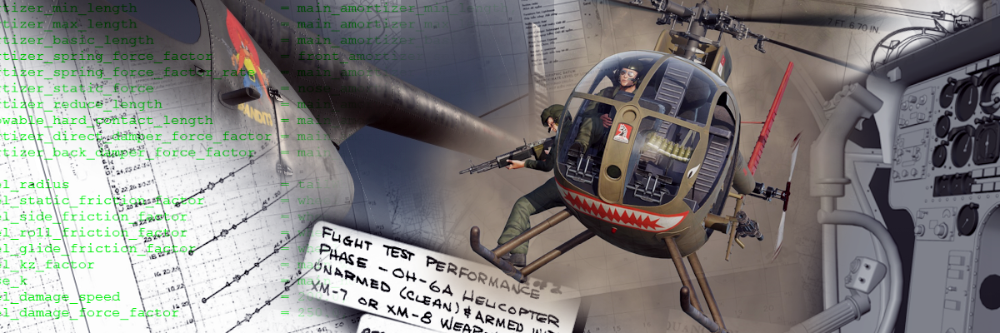

# DCS: OH-6A by Tobsen & Eightball

Welcome to OH-6A Mod by Tobsen and Eightball. Please read the readme.

Discord-server: https://discord.gg/zMjzfJuk26

## How to install

The mod pack is splitted into following parts. Follow each installation steps described in the release notes:

### OH-6A:
https://github.com/tobi-be/DCS-OH-6A/releases/tag/v1.4
### OH-6A Livery Pack:
https://github.com/tobi-be/DCS-OH-6A/releases/tag/Liverypack_v1.3
### Vietnam Assets Pack:
https://github.com/tobi-be/DCS-OH-6A/releases/tag/VAPv1.2
### Playground Pack:
https://github.com/tobi-be/DCS-OH-6A/releases/tag/opp-v1.0

### Setup
- Download zips
- Unzip the .zip file/files
- Make sure DCS is shut down
- Copy the the Folders "**Mods**" and "**Scripts**" to the to DCS folder in **Saved Games**  
  e.g. C:\Users\XXX\Saved Games\DCS.openbeta\ or C:\Users\XXX\Saved Games\DCS\

previous Releases:

  https://github.com/tobi-be/DCS-OH-6A/releases

## Known issues

Please have in mind that this is a community mod done by a small team in their spare time. This mod is not subject to ED's quality control. There are some things which might not be perfect and some thing which will be addressed in future updates. We are open for suggestions. Please feel free to contact us on our Discord-server.

Known issues which might be fixed in the future
- missing Copilots model
- missing Minigun Doorgunner model
- Mod is not designed to be used as AI. It might show faulty behaviour
- Target prioritization of the doorgunner is not implemented yet.
- On missions with a lot of units doorgunner scripts can cause micro stuttering. 
  Remove gunner_export_hook.lua from Saved Games\DCS.openbeta\Scripts\Hooks to avoid it (Doorgunner won't be functional anymore)

Known issues due to modding limitations
- Limited radio functionalities
- no return fire ROE for Doorgunner
- Smoke grenades ignite on impact and not time-delayed
- Weapon sounds cannot be changed.
- The OH-6A needs to be shut down to be able to rearm, refuel and repair.
- Multicrew. Multicrew is a topic for it self. We decided not to implement it as long as it works properly.

## FAQ

**Why does the helicopter yaws at takeoff although pedals are neutral?**

This is how helicopters work. The tailrotor needs to compensate the torque of the mainrotor. This is usually not done in the neutral position. 

**Why does the helicopter tilt at takeoff although cyclic is neutral?**

This is how helicopters work. The tailrotor needs to compensate the torque of the mainrotor. In addition to the yaw effect the tail rotor pushes the helicopter to the side. This needs to be compensated with the cyclic.

## Startup
There is a training mission available. Please do the training mission to get familiar with the arrangment in the cockpit. To startup the OH-6A you have to perform following steps:

* Turn on the Battery (midpanel)
* Open fuel valve (midpanel)
* Press Govenor trim decrease for 7 seconds 
* Press and keep pressed starter button
* Turn throttle to idle (Default: Insert) when N1 reaches 12 to 15%
* Keep pressing starter button until N1 reaches 60%
* Enable Generator
* Enable Inverter
* Gyro to Magnetic (On)
* Adjust Altimeter
* Increase Throttle (Default: Page Up) step by step to increase N2.
* When Throttle is max and N2 is stable adjust N2 with the governor trim increase/decrease.

## Flyingtips

The OH-6A has no stability aid. This means that the pilot must/may do all the work alone. Every action on one of the controls needs correction on the other controls. 

### Trim position

There is a neutral position of the controls for each flight attitude of the OH-6A. 
This trim position depends on the load, on the weather and on the center of gravity which maybe shifted due to loadouts. 

Try to find this trim position and only make small control deflections around this position. For take off the cyclic should be left and aft and you need a good amount of left pedal. 

### Watch torque

The OH-6A is not powerlimited in most cases but the main transmissions needs to be operated in it's torque limitatios.

### Slow approaches

The OH-6A has tendencies to overshoot. So be prepared and do slow approaches.

### Heavy Loadouts

Avoid heavy loadouts. 

## Weapons

The OH-6A was mainly used as an observation helicopter. Nevertheless it can be equipped with weapons. There is a weapons training mission available.

### Grenades

The most important task of the OH-6A is to mark targets with smoke grenades. The OH-6A can be equipped with smoke grenades in diffent colors at the Stations G1 to G4 in groups of 4 grenades each. In addition to that 10 HIGH Explosive Grenades can be equipped at station HE. 

To drop the Frag Grenades or the Smoke Grenades, press “G”.

To change the color of the Smoke Grenades, press “T”.

The actual selected color is displayed in the Crew Status Overlay.

### Minigun

The M27 armament subsystem is used on the left side of the aircraft. It consists of an 7.62 mm M134 machine gun and an XM70E1 reflex sight. 

The elevation of the gun can be controlled with switches on the cyclic. (Default up: U, down: J) 

The reflex sight can be positioned in front of the pilots face or stowed by clicking it or by pressing "O". 
The height of the sight can be adjusted by pressing Y (up) or H (down). 

In order to fire the minigun the Armed-Safe switch at the armament panel needs to be switched to armed.

The Weapons Master Switch needs to be switched to Fire norm. Position "Off" disables the gun and "Fire to Clear" is used to clear the gun. 

The Weapons selector switch at the rocket panel needs to be switched to 7.62.

Press "Space" to fire the gun. 

### XM158 Rockets

Rockets are rarely used as they are quite heavy for the Loach. 

In order to use the rockets the Armed-Safe switch on the armament panel needs to be switched to armed.

The Weapons selector switch on the rocket panel needs to be switched to 40. 

The number of rocket pairs needs to be selected (>0).

To fire rockets press "Space" until the salvo is complete. 

### Doorgunner

The OH-6A can be equipped with an AI M60 Doorgunner on the right side. (a M134-Doorgun is implemented too but it was not a real usecase and there is no Gunner model yet.)

The ROE for the Gunner can be toggled between hold and fire (Default: M)

The burstlength can be toggled between LONG and SHORT (Default: RALT+M)

The Crew Status Overlay can be toggled ON/OFF (Default: LWIN + M)

## Additional Equipment

### Searchlight

A Searchlight can be equipped.

The Searchlight can be turned on and off by pressing “SearchLight” (Default: Rshift + L).

It can be operated in 3 different modes:

#### 1.a Manual 

  In manual mode the searchlight can be controlled by keys WASD (Searchlight Up, Left, Down and Right).

#### 1.b Ground Locked

Enabling ground locked mode can be done from manual mode. Once you moved the spotlight to a place on the ground which you want to observe you need to press the ‘Searchlight Lock’ (Default: Q). The Searchlight tries to follow the spot. Press Q again to unlock.

#### 2. Tracking Enemy Units 

Enemy units can be tracked with the Searchlight automatically. To enable this mode you have to press Toggle Searchlight Mode (Default: E). 

If you want to use Manual Mode or Ground locked Mode again you have to press Toggle Searchlight Mode again.

### Camrig

The Camrig is purely a visual feature.

The camera tracks enemy units automatically to add some immersion.

### Floaters

Floaters can be equipped to be able to land on water. 

## Radios
In order to choose the transmitting radio one has to use the lower intercom panel selection knob (PVT, INT, 1, 2, 3, 4)
### FM AN/ARC-54
Frequency Range:  30.00 to 69.95 MHz FM

Intercom panel knob: 1

### VHF AN/ARC-54
Frequency Range:  225 to 400 MHz AM

Intercom panel knob: 2

Frequency can be dialed in manually or by using presets. The presets can be adapted in the mission editor.

## ADF

The OH-6A is equipped with a ADF System. The device is at the mainpanel close to the fuel indicator. 
-  Switch the power knob (Off/ADF/ANT/LOOP) to ADF.
-  Tune in the AM frequency (Display is in kHz). There are 3 bands (0.19-0.40, 0.40-0.84, 0.84-1.7 MHz), 
-  The indicator above the Tune Knob show the signal level.

Since this is done without SDK one will not hear signals. Only beacons which are placed in ME are available.

## RWR
The OH-6A was never equipped with RWR. Nevertheless we added it optionally since we had some free space on the main panel. To enable it one has to check the checkbox in mission editor at the additional properties tab.
Keybinds are available but are without default keys. (Search for RWR)

## Chaff/Flare Dispenser
The OH-6A was never equipped with Chaff/Flare Dispenser. Nevertheless we added it optionally. To enable it one has to check the checkbox in mission editor at the additional properties tab.

If enabled there is a little additional panel above the electric panel. 
Keybinds are available but are without default keys. (Search for Flares)

## Donations
https://ko-fi.com/taesimulations

## Additional 3D Models used in this project:

- "Sunglasses_Free" (https://sketchfab.com/3d-models/sunglasses-free-deeb41e3f5f1480bb6f79f474c9f7ef5) by AlvaWong (https://sketchfab.com/alvawong06)
- "M60 Light Machine Gun" (https://sketchfab.com/3d-models/m60-light-machine-gun-cbf408387dc94a30abe11afb3698ac13) by Pieter Ferreira (https://sketchfab.com/Badboy17Aiden)
- "Army Helmet | USS SAIPAN" (https://sketchfab.com/3d-models/army-helmet-uss-saipan-de5ab81a25ec470980f3c82e3d88188f) by Pieter Ferreira (https://sketchfab.com/ipoprock)
- "M18 Smoke Grenade" (https://sketchfab.com/3d-models/m18-smoke-grenade-6dbb48151a9147b4830aa7bf55fc8282) by RedRogueXIII (https://sketchfab.com/RedRogueXIII)
- "M134 handheld (Minigun)" (https://sketchfab.com/3d-models/m134-handheld-minigun-8f008c3e18934707a834cde8c72364f5) by Alexander_Borisevich (https://sketchfab.com/boriseviav)
- "Fire Extinguisher" (https://sketchfab.com/3d-models/fire-extinguisher-7fbd47c7e423461b86d599d30f4dfb33) by Kantemir (https://sketchfab.com/parabe11um789)
- "Square Rat Cage - Steampunk" (https://sketchfab.com/3d-models/square-rat-cage-steampunk-4834f44b7ef342129178579af4bd277c) by Alf Does Stuff (https://sketchfab.com/alfdoesstuff)
- "A small cage for a rodent" (https://sketchfab.com/3d-models/a-small-cage-for-a-rodent-94b4026b83dd4294ada53e854d2d4170) by jsdpk (https://sketchfab.com/annalivins)
- "lowpoly pig black" (https://sketchfab.com/3d-models/lowpoly-pig-black-3837b45508f84399820b8bad3d6c2520) by fabiotambone (https://sketchfab.com/fabiotambone)
- "Mallard Duck (Male)" (https://sketchfab.com/3d-models/mallard-duck-male-16c14682b3414f34b26bf4d558d40a0f) by ucdavisterc (https://sketchfab.com/ucdavisterc)
- "Sheep" (https://sketchfab.com/3d-models/sheep-67abff7459f34afca11e3effab62c761) by hendrikReyneke (https://sketchfab.com/hendrikReyneke)
- "Chicken" (https://sketchfab.com/3d-models/chicken-454d2b298a2f4fff855ad625ff1721d7) by Rigardas.Kusleika (https://sketchfab.com/Rigardas.Kusleika)
- "Bag rise" (https://sketchfab.com/3d-models/bag-rise-0ea75c0731444be1b47b1a3725a0067c) by Garikmrs (https://sketchfab.com/Garikmrs)
